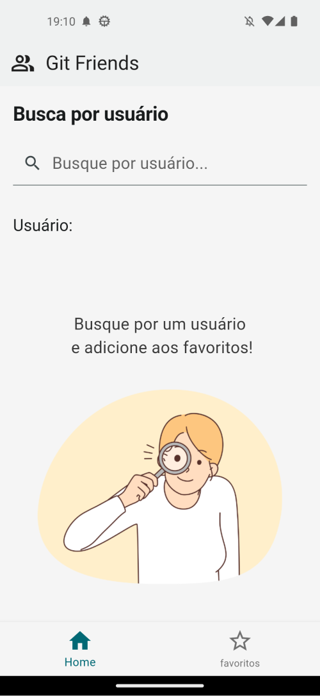

# Git Friend APP
Este projeto foi feito para fins de estudo de desenvolvimento mobile usando flutter, arquitetura MVVM e os padrões de projeto Repository e DAO.
Ele consiste em um aplicativo onde o usuário pode buscar por outros usuários do github e adiciona-los aos favoritos em memória:

## Principais tecnologias usadas
- **Flutter**:
Um framework de código aberto desenvolvido pelo Google para criar aplicativos nativos para dispositivos móveis, web e desktop a partir de uma única base de código. Ele utiliza a linguagem de programação Dart e oferece uma ampla gama de widgets personalizáveis para criar interfaces de usuário bonitas e responsivas.

- **Dart**:
Uuma linguagem de programação desenvolvida pelo Google, amplamente utilizada para criar aplicativos móveis e web, especialmente em conjunto com o framework Flutter. Ela é conhecida por sua sintaxe limpa, tipagem estática opcional e capacidade de compilar código nativo eficiente para várias plataformas.

- **sqflite**:
Uma biblioteca em Dart que fornece uma interface simples para operações de banco de dados SQLite em aplicativos Flutter. Ele permite que os desenvolvedores armazenem e acessem dados de forma eficiente em aplicativos móveis, fornecendo uma camada de abstração sobre o SQLite.

- **Dio**:
Uma biblioteca HTTP em Dart para fazer requisições de rede em aplicativos Flutter. Ela oferece uma API simples e intuitiva para realizar operações de rede, como fazer solicitações HTTP, enviar dados e receber respostas. Dio suporta várias opções de personalização e tratamento de erros.

- **Auto_injector**:
É uma biblioteca em Dart que simplifica a injeção de dependência em aplicativos Flutter. Ela automatiza o processo de configuração e gerenciamento de dependências, permitindo que os desenvolvedores injetem facilmente objetos e serviços em suas classes, facilitando a manutenção e teste de aplicativos.

## Execução
- 1 Dá um fork neste repositório
- 2 Clone ou baixe o seu repositório fork
- 3 Abra seu terminal e navegue até a pasta do projeto
- 4 Rode o commando `flutter pub get` para baixar as dependências
- 5 Rode o commando `flutter run` para iniciar o projeto em modo de desenvolvimmento

# Layout

